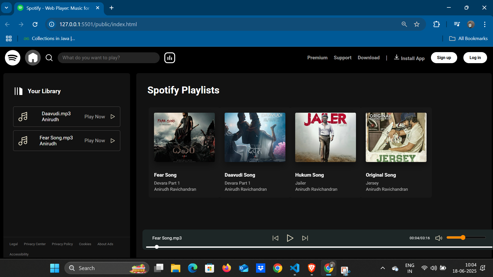

# 🎧 Spotify Clone 🎶  
*A clean and responsive web-based music player built using HTML, CSS, and JavaScript.*

---

## 📸 Preview

---

## 🌟 Features

- 🎵 Display of popular playlists with album covers
- 🎼 Integrated audio player with play, pause, next, and previous controls
- 🎚 Volume control and timeline slider
- 📂 Your Library section with quick access to added songs
- 🌓 Dark mode-inspired modern UI
- 📱 Fully responsive design

---

## 🛠️ Tech Stack

| Technology | Description |
|------------|-------------|
| **HTML5**  | Structure and layout of the app |
| **CSS3**   | Styling, animations, and layout |
| **JavaScript** | Functionality and audio controls |

---

## 🗂️ Project Structure

# Spotify_Clone
